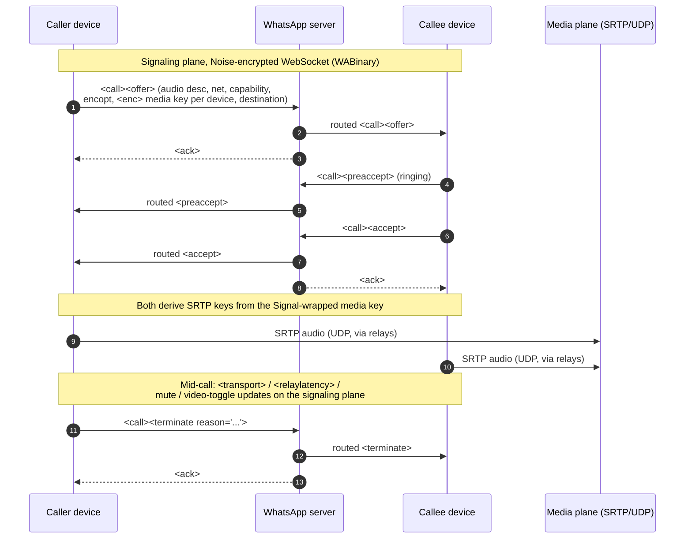

<!-- Hand-written narrative. Complements the generated docs under docs/spec/. -->

# Architecture

A WhatsApp 1:1 call runs over **two distinct planes** that are established and
operated independently:

1. **The signaling plane:** call *control* (offer, ring, accept, reject,
   terminate, transport updates, mute/video state). This rides the same
   Noise-protocol-encrypted WebSocket that WhatsApp multi-device uses for
   messaging, carried as WABinary nodes under a top-level `<call>` tag.
2. **The media plane:** the actual audio/video bytes. This is SRTP over UDP
   to WhatsApp voip/relay servers, negotiated using transport endpoints that the
   signaling plane exchanges. It does not travel over the WebSocket.

Keying bridges the two: the **media key** is delivered *on the signaling plane*,
encrypted to the peer with the existing Signal protocol session, and the SRTP
keys for the media plane are derived from it.

> Confidence note: the two-plane split and the Noise-WebSocket signaling
> transport are well-supported by how multi-device messaging works and are
> treated as `probable`. The precise SRTP key-derivation steps are
> `speculative` and flagged as such throughout.

## The two planes at a glance

| | Signaling plane | Media plane |
| --- | --- | --- |
| Carries | Call control stanzas | Audio/video frames |
| Transport | Noise-encrypted WebSocket (TCP) | SRTP over UDP |
| Encoding | WABinary `<call>` nodes | RTP/SRTP packets |
| Encryption | Noise (link) + Signal (per-stanza `<enc>`) | SRTP (keys derived from the Signal-delivered media key) |
| Routing | Through the WA server (store-and-forward, multi-device fan-out) | Direct or via WA relays (ICE/TURN-like) |
| Documented in | [Signaling](signaling.md), [Transport over Noise](transport-noise.md), [Keying](encryption-keying.md) | [Media / SRTP](media-srtp.md), [ICE & relays](ice-and-relays.md) |

## Where keying sits

Keying lives on the signaling plane but logically between the two. When a
device sends an offer, it includes one or more `<enc>` nodes whose payloads are
Signal-protocol ciphertext. Each `<enc>` delivers the call/media key to one peer
*device* (multi-device means several `<enc>` nodes per offer; see
[fan-out](encryption-keying.md#multi-device-fan-out)). Because the key is wrapped
in the recipient's Signal session, the WA server routes it but cannot read it.
Both endpoints then derive SRTP keys from that shared secret, and the media plane
comes up encrypted end-to-end.

## Call lifecycle

The diagram below sketches a typical outgoing 1:1 audio call. It is a *model*
that orients new contributors; individual stanzas are documented (with confidence
levels) in the generated [stanza catalog](spec/stanzas/index.md), and full
sequences live in the [flow catalog](spec/flows/index.md).

### Reading the diagram

- Steps 1–3: the offer is server-routed; the server `<ack>`s the sender.
- Steps 4–7: ringing (`<preaccept>`) and acceptance (`<accept>`) flow
  back through the server.
- After acceptance both sides bring up SRTP media over UDP, typically through
  WA relays selected from the offered transport endpoints. See
  [ICE & relays](ice-and-relays.md).
- During the call, transport and state updates continue on the signaling
  plane.
- The call ends with a `<terminate>` carrying a `reason` (e.g. `declined`,
  `timeout`, `busy`, `connection_lost`).

A call that is never answered ends with `<terminate reason="timeout">`; a
declined call with `<reject>` followed by `<terminate reason="declined">`. These
reason codes are catalogued in the generated
[enums page](spec/enums.md).

## What is firmer vs. softer

- **Firmer (`probable`):** the existence of the `<call>` node family; signaling
  over the Noise WebSocket; media over SRTP/UDP; the media key being delivered
  via `<enc>` Signal ciphertext; multi-device producing multiple `<enc>` nodes.
- **Softer (`speculative`):** exact attribute meanings (e.g. `net medium`,
  `encopt keygen`), the precise SRTP key schedule, relay candidate selection
  logic, and codec negotiation details.

Every claim above is mirrored in the corpus with an explicit `confidence` and,
where we are unsure, an `open_questions` entry. See
[methodology](methodology/index.md) for how those levels move.
