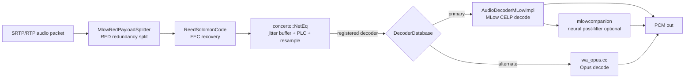

<!-- Hand-written narrative. Complements docs/media-srtp.md and the generated docs under docs/spec/.
     Findings here come from one technique (wasm-analysis); confidence is capped at `probable`. -->

# MLow and the audio media plane

WhatsApp's 1:1 call **audio** is carried by an in-house codec the binary calls
**MLow** (a CELP speech codec with an optional neural "companion" post-filter),
wrapped in a receive pipeline that is, structurally, **WebRTC's audio stack**
renamed. This page reconstructs that pipeline from a single static read of the
WhatsApp **Web** calling engine (Emscripten WASM), using
[warden](../../techniques/wasm-analysis.md) to mine the binary's own type
information.

> **Confidence.** Everything here is from **one** technique — static
> `wasm-analysis` — so by the [corroboration rule](../../methodology/index.md) it
> is at most **`probable`**, never `confirmed`. The *structure* (which component
> does what) rests on the binary's own C++ RTTI and source-path strings and is
> graded `probable`. The *inner codec algorithm* (bitstream layout, exact DSP) is
> only partially recovered and is graded `speculative`; it lives in
> [open questions](#open-questions). No key material or captured media is in this
> repo.
>
> **Provenance.** Module: WhatsApp Web calling engine `wa.wasm`,
> SHA-1 `3638a506b4055c2fc6bec75edff18512ca79fe64` (9,819,554 bytes).
> Technique `wasm-analysis` · tool `warden` · contributor `purpshell` · sources:
> commits `aa0996c`, `365daa6` and the machine-readable identity map at
> `impl/mlow/data/identity-map.json` (rendered in the
> [function map](function-map.md)). Method and exact queries:
> [methodology](methodology.md).

## Why this is recoverable at all

The mobile apps strip symbols, but the Web WASM still carries two kinds of
**ground-truth** strings that survived the build:

1. **C++ RTTI type names** (Itanium-mangled, e.g. `N8facebook3rtc9MLowFrameE`
   → `facebook::rtc::MLowFrame`). A function that references a class's typeinfo
   is constructing, destroying, or `dynamic_cast`-ing that class, so it pins the
   function to a concrete type.
2. **`__FILE__` paths** baked into asserts/logs (e.g.
   `xplat/wa-voip/wacall/media/src/codec/wa_opus.cc`). These map a function to its
   exact source compilation unit.

Neither depends on a model guess. They let us correct the many auto-generated
names that were wrong (see [function map](function-map.md)) and name the
subsystems with confidence.

## The receive (decode) pipeline

Each box is a real type or source file recovered from the binary; the function
indices backing each are in the [function map](function-map.md).

- **`concerto::MlowRedPayloadSplitter`** — splits an RTP payload that carries
  **RED**-style redundancy (a primary frame plus one or more older frames for
  loss resilience). `concerto` is the binary's name for its WebRTC-derived media
  core. *(`probable`)*
- **`facebook::rtc::ReedSolomonCode` / `ReedSolomonFactoryImpl` /
  `RSEncoderDecoder`** — a **Reed-Solomon** erasure code over the redundancy
  group, alongside WebRTC's own
  `modules/rtp_rtcp/source/multistream_forward_error_correction.cc`. The RED
  layer is FEC-protected, not bare duplication. *(`probable` that it is
  Reed-Solomon from the class names; the exact RS parameters are `speculative`.)*
- **`concerto::NetEq*`** — the receive buffer and concealment engine. The class
  set is **verbatim WebRTC NetEq**: `NetEqImpl`, `NetEqController`,
  `DecoderDatabase`, `DelayManager`, `DelayPeakDetector`, `PacketBuffer`,
  `BufferLevelFilter`, `TimestampScaler`, `Expand`/`ExpandFactory` and `Merge`
  (the packet-loss-concealment generators), and `StatisticsCalculator`. This is
  WhatsApp's fork of WebRTC's audio NetEq, renamed to `concerto`. *(`probable`,
  near-certain from the identical internal class names.)*
- **`concerto::DecoderDatabase`** — the pluggable decoder registry. MLow is the
  primary registered decoder; **Opus** (`wa_opus.cc`) is present as an alternate.
  *(`probable`.)*
- **`facebook::rtc::AudioDecoderMLowImpl`** — the MLow decoder itself: a CELP
  speech decoder (LPC synthesis with long-term/pitch prediction and an
  entropy-coded excitation). Its inner bitstream is the part still being
  recovered. Config it reads includes `mlow_dec_cutoff_hz` and the
  `WebRTC-MLowDecoder-lowPassCutoffFrequencyHz` field trial. *(decoder identity
  `probable`; algorithm `speculative`.)*
- **`mlowcompanion_*`** — a small neural post-filter ("companion") whose weights
  (`mlowcompanion_af1_kernel_bias`, `mlowcompanion_fnet_tconv_bias`, …) live in
  the data section and run on **ExecuTorch/XNNPACK** (the binary embeds
  `XNNCompiler.cpp` and `executorch` `op_*` kernels). It is **out of scope** for
  the reference implementation; intelligible audio is reachable without it.
  *(existence `probable`; everything else out of scope.)*

## The send (encode) side

The encoder is present (the binary both sends and receives MLow), but it exposes
less RTTI than the decoder, so it is less pinned today. The codec-selection and
framing source files are identified — `hybrid_codec.cc`, `wa_opus.cc`,
`codec_utils.cc`, `wa_audio_transformation.cc` — and the RED/RS path is shared
with receive. Encoder internals are tracked in
[open questions](#open-questions).

## Adjacent layers (named, not in scope here)

The same mining surfaced the layers around the codec, documented so the codec
boundaries are unambiguous:

- **E2EE media** — `facebook::rtc::e2ee::FrameDataHandlerGeneric`/`H264`,
  `KeyAccessTracker`, `FrameStatsCollector`: per-frame end-to-end media
  encryption (SFrame-style), distinct from the hop-by-hop SRTP in
  [media-srtp](../../media-srtp.md).
- **Congestion control** — `concerto::PacketPairBweV3`, `AimdRateControl*`,
  `DelayBasedBwe`: bandwidth estimation that drives MLow's target bitrate.
- **Platform glue** — `whatsapp::wasm::WasmAudioDriver` and the capture/playback
  drivers: the JS-boundary audio I/O, not the codec.

## What this changes for wacrg

[media-srtp](../../media-srtp.md) listed "confirm the audio codec" as the
**top** open question and marked the whole plane `speculative`. Static
`wasm-analysis` now answers the *structural* part of it at `probable`: the codec
is MLow (CELP + optional companion NN) with Opus as an alternate, carried over an
RED + Reed-Solomon FEC layer into a WebRTC-NetEq receive engine. Promoting any of
this to `confirmed` needs a **second, independent** technique — a Frida hook or a
live media capture that observes the same frames — per the
[corroboration rule](../../methodology/index.md).

## Open questions

These are the gaps between "we can name the component" and "we can re-implement
it bit-exactly." They are `speculative` until recovered.

1. **MLow bitstream layout.** Frame header/TOC and how subframes are packed.
   Recovered by the reconstructions: MLow is a **split-band CELP** codec
   (internally "SMPL"), *not* the MDCT hybrid an earlier note guessed - the MDCT
   DSP cluster in `wa.wasm` is the **standard-Opus/CELT fallback path**, which
   the decoder routes to separately (a TOC with top bits `11` is stock Opus; an
   MLow "smpl" TOC goes to the CELP decoder). See
   [decode-pipeline](decode-pipeline.md).
2. **Sample rate and frame size.** The binary references **8000** and **16000**
   internally, while configuration language elsewhere suggests a super-wideband
   (32 kHz) path with 20 ms frames. Whether MLow's core runs at 16 kHz with SWB
   handled by resampling is unresolved. *(`speculative`; tracked as a
   discrepancy.)*
3. ~~**Is the entropy coder the Opus/CELT range coder?**~~ **Answered (verified).**
   Yes: libopus' CELT range coder (`ec_dec`), present unmodified, matched
   constant-for-constant in #8855-8861 and reproduced + round-trip tested in Go.
   See [decode-pipeline](decode-pipeline.md#entropy-coder-the-celt-range-coder-verified).
4. **Reed-Solomon parameters.** Symbol size, block length, and how the RED group
   maps onto RS shards.
5. **Encoder internals.** Bitrate control (driven by the BWE above), DTX/VAD, and
   how `mlow_red_secondary_complexity` selects redundancy strength.
6. **Companion NN.** Architecture and where it sits in the signal chain
   (post-filter vs. excitation enhancement). Documented as out-of-scope, but its
   presence affects how close a companion-free decode can sound.

## See also

- [Decode pipeline](decode-pipeline.md) — the verified CELT range coder, the
  SMPL CELP synthesis path, and the standard-Opus-vs-MLow TOC routing.
- [Function map](function-map.md) — the class/source/function identity table and
  the corrected names.
- [Methodology](methodology.md) — every query used to derive this, reproducibly.
- [media-srtp](../../media-srtp.md) — the SRTP/RTP transport this rides on.
- [wasm-analysis](../../techniques/wasm-analysis.md) and
  [warden](https://github.com/purpshell/warden) — the technique and tool.
