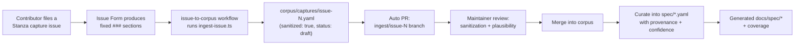

<!-- Hand-written narrative. Complements the generated docs under docs/spec/. -->

# The capture pipeline

This page traces a single observation from a contributor's screen all the way
into the specification, and explains the provenance trail and sanitization
requirements that hold the whole thing together.

## The path: Issue Form → ingest → corpus PR → spec

### 1. File a Stanza capture issue

Contributors use the **Stanza capture** GitHub Issue Form. It enforces a fixed
set of headings so the data is machine-parseable. In order, the form produces
these `### ` sections in the issue body:

1. Stanza tag
2. Direction
3. Client / platform
4. Capture technique
5. Confidence
6. Raw stanza
7. Decoded structure
8. Observed attributes
9. Provenance
10. Notes / open questions

Filing the form applies the labels `type/stanza-capture` and
`status/needs-review`.

### 2. Ingest

The [`issue-to-corpus`](../../.github/workflows/issue-to-corpus.yml) workflow
triggers on issues labelled `type/stanza-capture`. It runs
`scripts/ingest-issue.ts`, which:

- reads `ISSUE_NUMBER`, `ISSUE_TITLE`, `ISSUE_BODY` from the event,
- splits the body on `^### ` into (heading, value) sections,
- maps those sections to a [capture object](../../corpus/README.md),
- writes `corpus/captures/issue-<N>.yaml` with `sanitized: true` and
  `status: draft`, tolerating missing sections gracefully.

### 3. Corpus PR

The workflow then opens a pull request (`peter-evans/create-pull-request`) from a
branch `ingest/issue-<N>`. The PR contains exactly the new capture file. Nothing
is auto-merged — a human reviews it.

### 4. Review → corpus

A maintainer checks the PR for two things: **sanitization** (no PII/secrets) and
**plausibility** (does the decode make sense?). Once satisfied, the capture lands
in `corpus/captures/`. It is now part of the raw evidence record.

### 5. Curate → spec

Captures are *evidence*, not yet *spec*. Maintainers reconcile one or more
captures into curated [`spec/`](../../spec/) entries — adding or updating stanza
attributes, attaching **provenance**, and setting **confidence** per the
[corroboration rule](index.md#the-corroboration-rule-how-confidence-is-promoted).
When this lands, the generator rebuilds [`docs/spec/`](../spec/index.md) and the
[coverage report](../spec/coverage.md).

## The provenance trail

The point of the pipeline is that **nothing loses its origin**:

- The capture records its `source.technique`, optional `source.issue`,
  `source.contributor`, and `confidence`.
- When a fact is promoted into a spec stanza, the stanza attribute's
  `provenance.techniques` and `provenance.sources` (e.g. `["#42"]`) point back at
  the techniques and issues that justify it.
- A reviewer can therefore walk from any line in the rendered spec → its
  confidence → its provenance → the originating capture and issue. That walkable
  chain is what lets independent contributors trust each other's work.

## Sanitization requirements

Sanitization is **non-negotiable** and happens *before* anything is committed.
The [corpus README](../../corpus/README.md) has the full rules; the essentials:

- Replace JIDs/phone numbers with placeholders (`A@s.whatsapp.net`,
  `B@s.whatsapp.net`).
- Replace **all** key material and Signal ciphertext with labelled placeholders.
  Never paste real bytes.
- Strip identifying relay/IP specifics.
- `sanitized: true` is an explicit assertion that you verified the record is
  clean — the [schema](../../corpus/schema/capture.schema.json) rejects anything
  else, and reviewers double-check it.
- Use **synthetic test accounts** for any live capture. Do not capture other
  people. See [legal and ethics](../legal-and-ethics.md).

## Adding a capture by hand

You do not have to use the Issue Form. Copy
[`example-sanitized-offer.yaml`](../../corpus/captures/example-sanitized-offer.yaml),
edit it, run `npm run validate`, and open a PR. The validator checks it against
the capture schema and verifies referential integrity (e.g. that your
`source.technique` is one of the six fixed ids).
