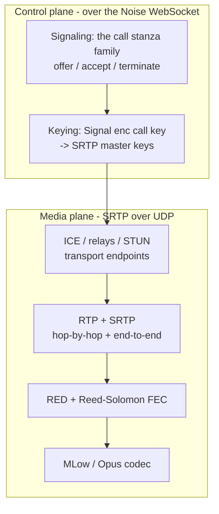

<!-- Hand-written narrative: the system-level gap analysis for reconstructing a
     working 1:1 call client. Complements the per-plane docs and docs/spec/. -->

# Reconstructing a WhatsApp 1:1 call client

What would it take to build a client that can place and receive a real 1:1
WhatsApp call end to end, not just document a stanza but stand up signaling,
keying, transport, and live audio? This page is the system-level gap analysis: it
maps every layer a working call needs, grades how reconstructable each is today,
and names the slowest piece to reconstruct. The codec-internals detail lives in the
[MLow reconstruction roadmap](codec/mlow/reconstruction-roadmap.md); this page is
the whole stack.

> **Provenance.** Layer status is drawn from the wacrg
> [coverage report](spec/coverage.md) and the per-plane docs (cited inline);
> media-internals claims are `wasm-analysis` · tool `warden` · contributor
> `purpshell` (one technique, so `probable`/`speculative`). This is a planning
> document, not a set of new corpus facts; specifics are graded where stated.

## The layers a working call needs

A call is four planes stacked over one Noise-encrypted WebSocket plus a separate
media path:

To complete a call a client must: (1) exchange `<call>` signaling, (2) unwrap the
media key and derive SRTP keys, (3) negotiate a transport path (direct or relay)
via ICE/STUN, (4) frame audio as RTP, protect it with SRTP, add RED/RS
redundancy, and (5) encode/decode the audio with MLow (or Opus).

## Status by plane

Maturity = how close to "reconstructable end to end". Coverage = the wacrg
[metric](spec/coverage.md). "Frontier" = the specific thing blocking full
reconstruction.

As of 2026-06, independent reconstructions exist and largely work: a Go
reference ([meowmeow](spec/tools.md), byte-exact codec from captured vectors), a
TypeScript caller ([zapo-caller](spec/tools.md)), and a Rust stack
([whatsapp-rust](spec/tools.md)) that wires the whole media plane. That changes
the question from "is it reconstructable" (mostly yes) to "is it documented and
confirmed".

| Plane | wacrg confidence | Reconstruction status | Frontier (what's missing) |
| --- | --- | --- | --- |
| **Signaling** | ~29% mapped | **Working** in all three reconstructions: `<call>` offer/accept/preaccept/terminate, the child order, receipt-ack, keygen v2, the call state machine. See [signaling](signaling.md), [WASM view](signaling/wasm-call-handling.md). | Edge stanzas, exact enums, group/waiting-room detail. |
| **Keying** | E2E SRTP **`confirmed`**; SFrame/HBH `probable` | **Working + KAT-pinned**: E2E SRTP, HBH two-stage KDF, SFrame (AES-GCM), WARP auth key. See [SRTP](keying/srtp-key-schedule.md), [SFrame](keying/sframe-media-e2ee.md). | Rekey policy; exact layer ordering; a live capture for `confirmed` on SFrame. |
| **Transport** | now `probable` | **Working**: WARP/RTP, STUN relay dialect, derived SSRC, MESSAGE-INTEGRITY. See [WARP/STUN/relay](transport/warp-stun-relay.md). Live DTLS/SCTP data-channel deferred in the Rust stack (PORT_PLAN). | Allocate protobuf schema; RTCP layout; a fresh capture. |
| **Media codec** | `probable` (corroborated) | **Working decoder** (Go + Rust, byte-exact vs captured vectors): MLow = split-band CELP + CELT range coder; RED SplitRed. See [MLow](codec/mlow/index.md), [decode pipeline](codec/mlow/decode-pipeline.md). | A from-spec re-derivation (vs port); the encoder's bit-allocation detail. |

## The implementation reality

The earlier view that the codec was the single biggest unknown is out of date.
Three independent reconstructions now drive the media plane, and the codec, the
slowest piece to reconstruct, has a byte-exact, vector-validated decoder in both Go and
Rust. So a fully functional 1:1 audio call is reconstructable
end to end today; what remains for wacrg is to document and confirm it:

1. **Audio media**: solved in practice. MLow CELP decode/encode + RED + WARP
   framing all exist and validate against captured vectors. wacrg's job is the
   spec text and an independent re-derivation, not discovery.
2. **End-to-end keying**: the SRTP KDF is now `confirmed`; SFrame (AES-GCM) and
   the HBH two-stage KDF are recovered and KAT-pinned. The remaining gap is a
   recorded live capture to promote SFrame to `confirmed`, plus rekey policy.
3. **Live transport orchestration** (DTLS/SCTP data-channel, relay media loop) is
   the piece the Rust stack explicitly defers (PORT_PLAN.md): the last mile to a
   working call, not a protocol unknown.

## Binary coverage: verified vs guessed

A warden knowledge base of `wa.wasm` reports every one of its **13,219 defined
functions** as "named", which is misleading. The breakdown:

| Provenance | Count | Trust |
| --- | --- | --- |
| oracle (libc / musl / Emscripten runtime) | ~1,235 | reliable (fingerprinted) |
| human (body-verified in this work) | ~dozen | reliable |
| agent (the LLM deep pass) | ~11,942 | guesses, repeatedly wrong |

So ~9% is reliably mapped and ~90% is an unverified guess. The agent names and
their "understanding" notes are a *starting index*, not knowledge: this work has
already caught them naming a config function the "decoder", tagging H.264 video as
MLow, and missing the HKDF layer entirely. Treat any single agent name as a lead
to verify, never a fact.

What is verified so far is a few dozen functions: the audio entropy coder
(CELT range coder), one LPC kernel, SHA-256, the four CDF tables, the SRTP crypto
primitives, and the codec class identities. Everything below is unmapped in
the strong sense (no body verification), grouped by subsystem the binary's own
RTTI reveals:

- **Audio codec internals**: the data-dependent decode loop (the actual MDCT/LPC
  synthesis grammar), the NLSF/gain/excitation tables, the encoder, and the exact
  RED + Reed-Solomon byte format. The frame format is only *agent-reported*.
- **SFrame per-frame E2EE** (`facebook::sframe`): located, key schedule unread.
- **NetEq** (`concerto::*`, ~266 fns): named verbatim from WebRTC, algorithms
  unread (jitter, PLC Expand/Merge, delay manager).
- **Bandwidth estimation** (`concerto` BWE: PacketPairBwe, AimdRateControl): named,
  unread.
- **Video**: an entire OpenH264 codec (`WelsEnc`/`WelsDec`/`WelsCommon`/`WelsVP`,
  ~260 fns) plus H.26x packetization. Out of the audio scope, wholly unmapped.
- **The companion NN runtime** (`executorch`, ~378 fns; XNNPACK): the ML inference
  engine behind `mlowcompanion`. Wholly unmapped (and out of scope).
- **Transport in the WASM**: the Noise socket, the relay/STUN dialect builders,
  and DTLS/SCTP. Only preliminary survey, no body verification.
- **Platform glue** (`whatsapp::wasm::WasmAudioDriver` ~494 fns, capture/playback
  drivers): named, not deeply understood.
- **JSON / utility** (`nlohmann`, ~37) and the long tail of app logic.

In short: the architecture is mapped, a handful of load-bearing
algorithms are verified, and the other ~90% is indexed but unverified.

## wasm-analysis reaches the under-served frontiers

The wacrg [coverage report](spec/coverage.md) shows `wasm-analysis` has
contributed 0 spec facts so far, yet it is the only technique that statically
reaches the two under-served frontiers (keying and media internals)
because the Web client's WASM *implements* both. The MLow codec identification is
the first wasm-analysis result (still narrative, not yet promoted to `spec/`). The
same method applies next to:

- **The SRTP key schedule**, the highest-value target in the spec. The
  WASM contains the KDF (HKDF/RFC3711-style derivation, `hbh_srtp_key` /
  `warp auth key` material, the dual end-to-end + hop-by-hop layers). Reading it
  converts keying's biggest `speculative` block toward `probable`. This is the
  queued encryption + transport work.
- **The relay/STUN transport dialect**, pinning the exact packet layouts the
  prior Go work reconstructed empirically.

Promoting any of these to `confirmed` still needs a second technique (a Frida
hook or a capture) per the [corroboration rule](methodology/index.md); static
analysis alone caps at `probable`.

## Critical path to a fully functional client

In dependency order, what remains between "connects" and "real audio call":

1. **MLow decode** (the [media frontier](codec/mlow/reconstruction-roadmap.md)):
   frame parse -> the entropy schedule + tables -> DSP synthesis -> PCM. ~80% of
   the remaining media work; highest risk.
2. **MLow encode** (the mirror) for the send direction.
3. **RED/RS + RTP/SRTP media framing** so frames survive the network and decrypt.
4. **SRTP key derivation** for a correct, interoperable keying path.
5. **Per-frame E2EE media crypto** (`e2ee::*`) for true end-to-end media.

Items 1-3 are what make a call audible; items 4-5 are what make it correct and
private. The codec (1-2) is the slowest piece to reconstruct.

## Limits

- **No decode oracle.** By project decision there are no live codec tests, so
  media-internal claims can be checked only structurally (round-trips, plausible
  output), not against ground truth, until a runtime technique corroborates.
- **Static reach.** wasm-analysis recovers *intended* logic. The keying KDF and
  the codec grammar are recoverable but tedious and silent-on-error; a single
  captured frame or hooked key would de-risk each enormously.
- **Scope.** Group calls, video, and the companion NN are out of scope for this
  reconstruction.

## Where the detail lives

- Media / codec: [MLow index](codec/mlow/index.md) and its
  [reconstruction roadmap](codec/mlow/reconstruction-roadmap.md).
- Keying: [encryption & keying](encryption-keying.md).
- Transport: [transport](transport-noise.md), [ICE & relays](ice-and-relays.md).
- Signaling: [signaling](signaling.md).
- Method and tooling: [methodology](methodology/index.md),
  [wasm-analysis](techniques/wasm-analysis.md).
