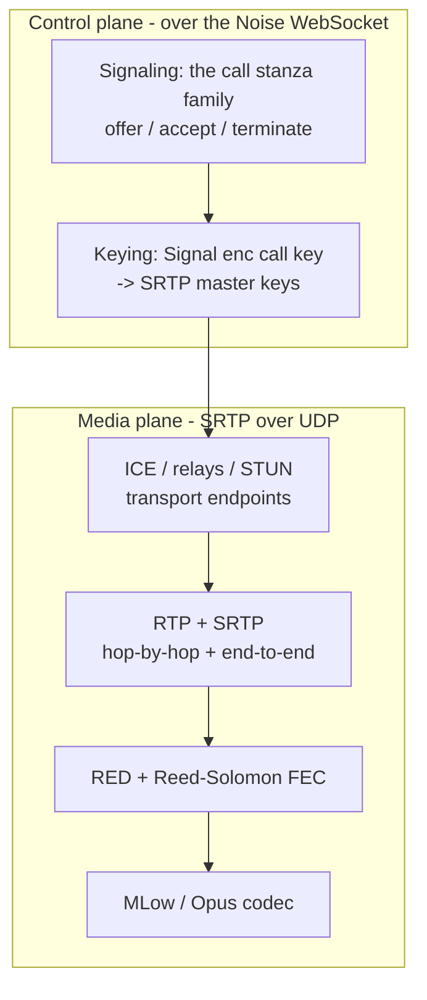

<!-- Hand-written narrative: the system-level gap analysis for reconstructing a
     working 1:1 call client. Complements the per-plane docs and docs/spec/. -->

# Reconstructing a WhatsApp 1:1 call client

What would it take to build a client that can **place and receive a real 1:1
WhatsApp call end to end** — not just document a stanza, but stand up signaling,
keying, transport, and live audio? This page is the system-level gap analysis: it
maps every layer a working call needs, grades how reconstructable each is today,
and names the long pole. The codec-internals detail lives in the
[MLow reconstruction roadmap](codec/mlow/reconstruction-roadmap.md); this page is
the whole stack.

> **Provenance.** Layer status is drawn from the wacrg
> [coverage report](spec/coverage.md) and the per-plane docs (cited inline);
> media-internals claims are `wasm-analysis` · tool `warden` · contributor
> `purpshell` (one technique, so `probable`/`speculative`). This is a planning
> document, not a set of new corpus facts; specifics are graded where stated.

## The layers a working call needs

A call is four planes stacked over one Noise-encrypted WebSocket plus a separate
media path:

To complete a call a client must: (1) exchange `<call>` signaling, (2) unwrap the
media key and derive SRTP keys, (3) negotiate a transport path (direct or relay)
via ICE/STUN, (4) frame audio as RTP, protect it with SRTP, add RED/RS
redundancy, and (5) encode/decode the audio with MLow (or Opus).

## Status by plane

Maturity = how close to "reconstructable end to end". Coverage = the wacrg
[metric](spec/coverage.md). "Frontier" = the specific thing blocking full
reconstruction.

| Plane | wacrg coverage | Reconstructable now | Frontier (what's missing) | Best technique to finish |
| --- | --- | --- | --- | --- |
| **Signaling** | ~29% (74 facts) | Yes, mostly. The `<call>` family (offer/accept/preaccept/terminate, relay/transport, mute) is the best-mapped layer. See [signaling](signaling.md). | Edge stanzas, exact enum values, group vs 1:1. | websocket-capture (have it) |
| **Keying** | low / `speculative` | Partly. Delivery via Signal `<enc>` fan-out is `probable`; reusing the messaging stack works. See [keying](encryption-keying.md). | **SRTP key derivation** (KDF, labels, cipher suite, rekey) — "the most speculative part of the whole spec". | **wasm-analysis** (the WASM implements the KDF) + a runtime key observation |
| **Transport** | ~15% (27 facts) | Partly. Signaling rides the Noise socket; media uses ICE/STUN to relays. The relay STUN dialect (bind `0x0001`, keepalive `0x0801`, teardown `0x0800`) is partly recovered from captures. See [transport](transport-noise.md), [ICE & relays](ice-and-relays.md). | Exact STUN attribute layouts, DTLS/SCTP data-channel role, relay auth tokens. | wasm-analysis + capture |
| **Media** | ~27% (11 facts) | Setup yes; **audio no**. SRTP/RTP transport is `probable`. The codec is now identified: MLow (LPC+MDCT hybrid) / Opus over RED + Reed-Solomon. See [media](media-srtp.md), [MLow](codec/mlow/index.md). | **The codec itself** (encode/decode to PCM) and the exact RED/RS + RTP framing. The codec is the single biggest unknown in the whole system. | **wasm-analysis** (the [MLow roadmap](codec/mlow/reconstruction-roadmap.md)) |

## The implementation reality

The control path is further along than the spec coverage suggests, because prior
Go work (the `meowmeow`/`dublin` line, outside this repo) already drives **live
calls**: it implements `<call>` signaling, the Noise transport, ICE/relay binding,
and SRTP setup well enough to capture real relay traffic. So **signaling,
transport, and SRTP-establishment are demonstrably reconstructable** — the gap to
a *fully functional* client is concentrated in two places:

1. **Audio media (the long pole).** Sending and receiving actual sound requires a
   working **MLow encode/decode** plus correct **RED/RS + RTP/SRTP media framing**.
   This is the frontier the [MLow work](codec/mlow/reconstruction-roadmap.md) is
   attacking. Until it lands, a "call" connects but carries no intelligible audio.
2. **End-to-end keying detail.** Establishing a call needs *enough* keying to set
   up SRTP; a *correct, E2E-faithful* client also needs the exact **SRTP KDF** and
   the per-frame E2EE media crypto (`facebook::rtc::e2ee::*`, SFrame-style). These
   are `speculative` in the spec today.

## wasm-analysis is the unlock

The wacrg [coverage report](spec/coverage.md) shows `wasm-analysis` has
contributed **0 spec facts** so far, yet it is the only technique that statically
reaches the two under-served frontiers — **keying** and **media internals** —
because the Web client's WASM *implements* both. The MLow codec identification is
the first wasm-analysis result (still narrative, not yet promoted to `spec/`). The
same method applies next to:

- **The SRTP key schedule** — the highest-value target in the whole spec. The
  WASM contains the KDF (HKDF/RFC3711-style derivation, `hbh_srtp_key` /
  `warp auth key` material, the dual end-to-end + hop-by-hop layers). Reading it
  converts keying's biggest `speculative` block toward `probable`. This is the
  queued encryption + transport work.
- **The relay/STUN transport dialect** — pinning the exact packet layouts the
  prior Go work reconstructed empirically.

Promoting any of these to `confirmed` still needs a **second** technique (a Frida
hook or a capture) per the [corroboration rule](methodology/index.md); static
analysis alone caps at `probable`.

## Critical path to a fully functional client

In dependency order, what remains between "connects" and "real audio call":

1. **MLow decode** (the [media frontier](codec/mlow/reconstruction-roadmap.md)):
   frame parse -> the entropy schedule + tables -> DSP synthesis -> PCM. ~80% of
   the remaining media work; highest risk.
2. **MLow encode** (the mirror) for the send direction.
3. **RED/RS + RTP/SRTP media framing** so frames survive the network and decrypt.
4. **SRTP key derivation** for a correct, interoperable keying path.
5. **Per-frame E2EE media crypto** (`e2ee::*`) for true end-to-end media.

Items 1-3 are what make a call *audible*; items 4-5 are what make it *correct and
private*. The codec (1-2) is the long pole.

## Honest limits

- **No decode oracle.** By project decision there are no live codec tests, so
  media-internal claims can be checked only structurally (round-trips, plausible
  output), not against ground truth, until a runtime technique corroborates.
- **Static reach.** wasm-analysis recovers *intended* logic. The keying KDF and
  the codec grammar are recoverable but tedious and silent-on-error; a single
  captured frame or hooked key would de-risk each enormously.
- **Scope.** Group calls, video, and the companion NN are out of scope for this
  reconstruction.

## Where the detail lives

- Media / codec: [MLow index](codec/mlow/index.md) and its
  [reconstruction roadmap](codec/mlow/reconstruction-roadmap.md).
- Keying: [encryption & keying](encryption-keying.md).
- Transport: [transport](transport-noise.md), [ICE & relays](ice-and-relays.md).
- Signaling: [signaling](signaling.md).
- Method and tooling: [methodology](methodology/index.md),
  [wasm-analysis](techniques/wasm-analysis.md).
