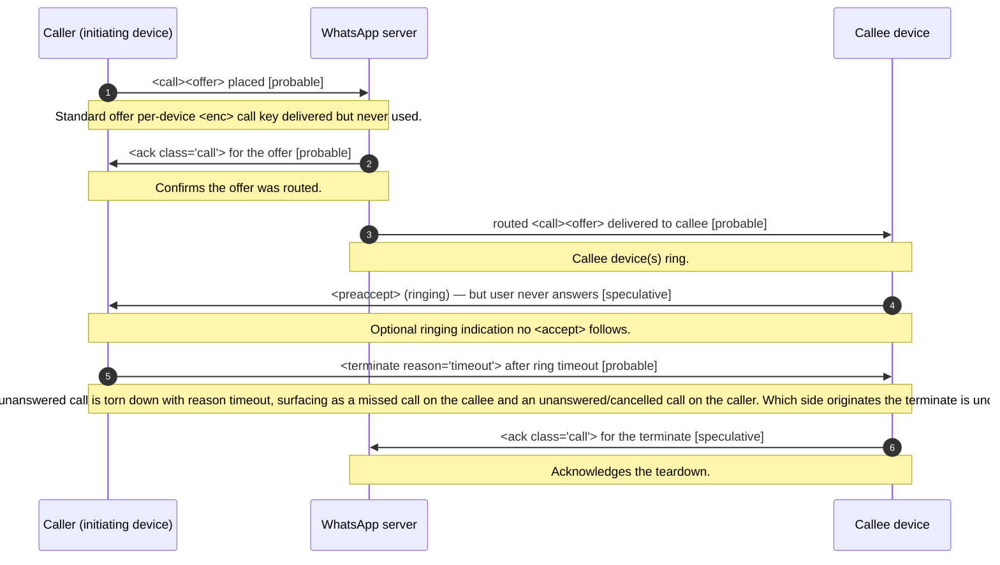

<!-- GENERATED FILE — do not edit by hand. Source: spec/ corpus. Run `npm run generate` to regenerate. -->

# Missed 1:1 call (no answer, ring timeout)

**Status:** draft  
**Spec version:** 0.1.0

## Summary

The sequence when a 1:1 call rings unanswered until the ring timeout elapses, producing a missed call. The caller's <call><offer> is routed to the callee, which rings (optional <preaccept>) but the user never answers. When the timeout is reached, a <terminate> with reason timeout ends the call: the caller's side logs an outgoing missed/unanswered call and the callee's side logs an incoming missed call. No <accept> occurs and no media is set up. Whether the timeout fires caller-side, callee-side, or server-side, and which party emits the terminate, is uncertain and noted in open questions.

## Sequence

## Participants

- **Caller (initiating device)** (`caller`)
- **WhatsApp server** (`server`)
- **Callee device** (`callee`)

## Steps

| # | From | To | Message | Stanza | Confidence | Note |
| --- | --- | --- | --- | --- | --- | --- |
| 1 | caller | server | <call><offer> placed | [`call-offer`](../stanzas/call-offer.md) | probable | Standard offer; per-device <enc> call key delivered but never used. |
| 2 | server | caller | <ack class="call"> for the offer | [`call-ack`](../stanzas/call-ack.md) | probable | Confirms the offer was routed. |
| 3 | server | callee | routed <call><offer> delivered to callee | [`call-offer`](../stanzas/call-offer.md) | probable | Callee device(s) ring. |
| 4 | callee | caller | <preaccept> (ringing) — but user never answers | [`call-preaccept`](../stanzas/call-preaccept.md) | speculative | Optional ringing indication; no <accept> follows. |
| 5 | caller | callee | <terminate reason="timeout"> after ring timeout | [`call-terminate`](../stanzas/call-terminate.md) | probable | The unanswered call is torn down with reason timeout, surfacing as a missed call on the callee and an unanswered/cancelled call on the caller. Which side originates the terminate is uncertain. |
| 6 | callee | server | <ack class="call"> for the terminate | [`call-ack`](../stanzas/call-ack.md) | speculative | Acknowledges the teardown. |

## Open questions

- Does the ring timeout fire on the caller, the callee, or the server?
- Which party originates the <terminate> on timeout?
- Is a caller-initiated cancel (caller gives up early) a distinct reason from timeout?
- Are other linked callee devices terminated with timeout or an "elsewhere" variant?

---

[Back to flow catalog](./index.md) · [Spec overview](../index.md)
