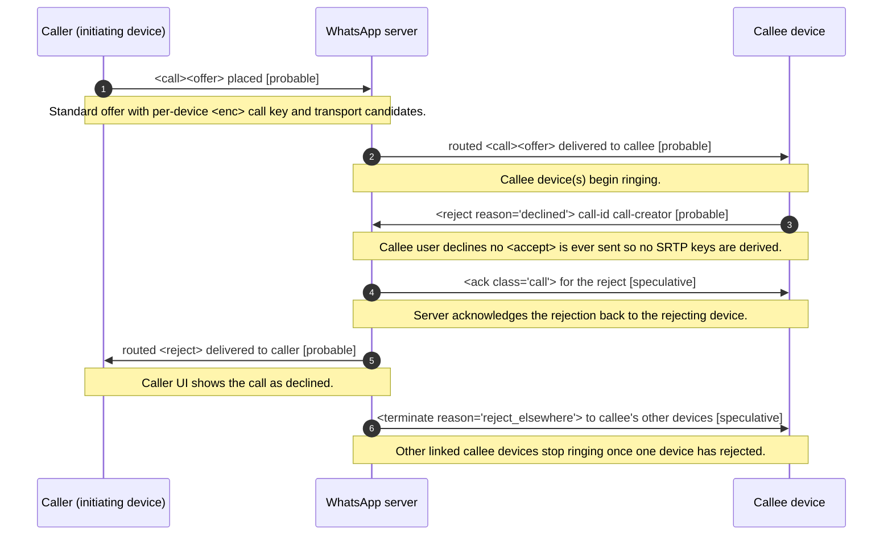

<!-- GENERATED FILE. Do not edit by hand. Source: spec/ corpus. Run `npm run generate` to regenerate. -->

# Callee rejects a 1:1 call

**Status:** draft  
**Spec version:** 0.1.0

## Summary

The sequence when the callee actively declines an incoming 1:1 call instead of answering. The caller's <call><offer> is routed to the callee, which (without ever accepting) sends a <reject> carrying the call-id/call-creator and a reason (e.g. declined). The server acks and routes the rejection back to the caller, whose UI shows the call as declined, and propagates a "reject_elsewhere" terminate to the callee's other linked devices so they stop ringing. No media is ever established. Step ordering and reason tokens are a working model and hedged.

## Sequence

## Participants

- **Caller (initiating device)** (`caller`)
- **WhatsApp server** (`server`)
- **Callee device** (`callee`)

## Steps

| # | From | To | Message | Stanza | Confidence | Note |
| --- | --- | --- | --- | --- | --- | --- |
| 1 | caller | server | <call><offer> placed | [`call-offer`](../stanzas/call-offer.md) | probable | Standard offer with per-device <enc> call key and transport candidates. |
| 2 | server | callee | routed <call><offer> delivered to callee | [`call-offer`](../stanzas/call-offer.md) | probable | Callee device(s) begin ringing. |
| 3 | callee | server | <reject reason="declined"> call-id call-creator | [`call-reject`](../stanzas/call-reject.md) | probable | Callee user declines; no <accept> is ever sent so no SRTP keys are derived. |
| 4 | server | callee | <ack class="call"> for the reject | [`call-ack`](../stanzas/call-ack.md) | speculative | Server acknowledges the rejection back to the rejecting device. |
| 5 | server | caller | routed <reject> delivered to caller | [`call-reject`](../stanzas/call-reject.md) | probable | Caller UI shows the call as declined. |
| 6 | server | callee | <terminate reason="reject_elsewhere"> to callee's other devices | [`call-terminate`](../stanzas/call-terminate.md) | speculative | Other linked callee devices stop ringing once one device has rejected. |

## Open questions

- Is the decline carried by a dedicated <reject> stanza, or a <terminate reason="declined">?
- Does the reject reason token match a value in the terminate-reasons enum, or a separate set?
- Is the "reject_elsewhere" propagation server-originated or peer-originated?

---

[Back to flow catalog](./index.md) · [Spec overview](../index.md)
