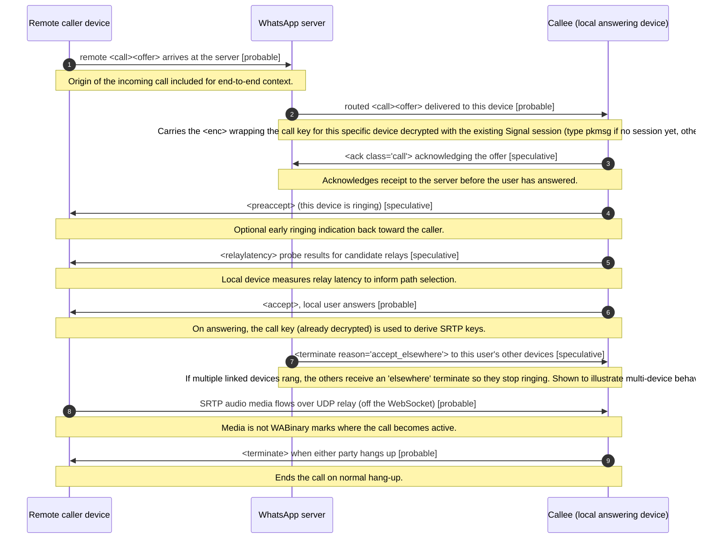

<!-- GENERATED FILE. Do not edit by hand. Source: spec/ corpus. Run `npm run generate` to regenerate. -->

# Incoming 1:1 audio call

**Status:** draft  
**Spec version:** 0.1.0

## Summary

The happy-path sequence from the local device's perspective when it RECEIVES a 1:1 audio call and answers. A remote caller's <call><offer> arrives via the server; the local device acks it, optionally signals ringing with <preaccept>, decrypts the call/media key from the <enc> node using its Signal session, and on the user answering sends <accept>. Transport and relay-latency exchanges select the media path and SRTP audio flows over UDP. This mirrors the outgoing flow with caller/callee roles swapped; ordering and acked hops are a working model.

## Sequence

## Participants

- **Remote caller device** (`caller`)
- **WhatsApp server** (`server`)
- **Callee (local answering device)** (`callee`)

## Steps

| # | From | To | Message | Stanza | Confidence | Note |
| --- | --- | --- | --- | --- | --- | --- |
| 1 | caller | server | remote <call><offer> arrives at the server | [`call-offer`](../stanzas/call-offer.md) | probable | Origin of the incoming call; included for end-to-end context. |
| 2 | server | callee | routed <call><offer> delivered to this device | [`call-offer`](../stanzas/call-offer.md) | probable | Carries the <enc> wrapping the call key for this specific device; decrypted with the existing Signal session (type pkmsg if no session yet, otherwise msg). |
| 3 | callee | server | <ack class="call"> acknowledging the offer | [`call-ack`](../stanzas/call-ack.md) | speculative | Acknowledges receipt to the server before the user has answered. |
| 4 | callee | caller | <preaccept> (this device is ringing) | [`call-preaccept`](../stanzas/call-preaccept.md) | speculative | Optional early ringing indication back toward the caller. |
| 5 | callee | caller | <relaylatency> probe results for candidate relays | [`call-relaylatency`](../stanzas/call-relaylatency.md) | speculative | Local device measures relay latency to inform path selection. |
| 6 | callee | caller | <accept>, local user answers | [`call-accept`](../stanzas/call-accept.md) | probable | On answering, the call key (already decrypted) is used to derive SRTP keys. |
| 7 | server | callee | <terminate reason="accept_elsewhere"> to this user's other devices | [`call-terminate`](../stanzas/call-terminate.md) | speculative | If multiple linked devices rang, the others receive an "elsewhere" terminate so they stop ringing. Shown to illustrate multi-device behaviour. |
| 8 | caller | callee | SRTP audio media flows over UDP relay (off the WebSocket) | - | probable | Media is not WABinary; marks where the call becomes active. |
| 9 | callee | caller | <terminate> when either party hangs up | [`call-terminate`](../stanzas/call-terminate.md) | probable | Ends the call on normal hang-up. |

## Open questions

- Does the local device ack the offer before or after deciding to ring?
- Is the "accept_elsewhere" terminate sent by the server or peer device, and with exactly that reason token?
- Is <preaccept> sent peer-to-peer or routed through the server?

---

[Back to flow catalog](./index.md) · [Spec overview](../index.md)
