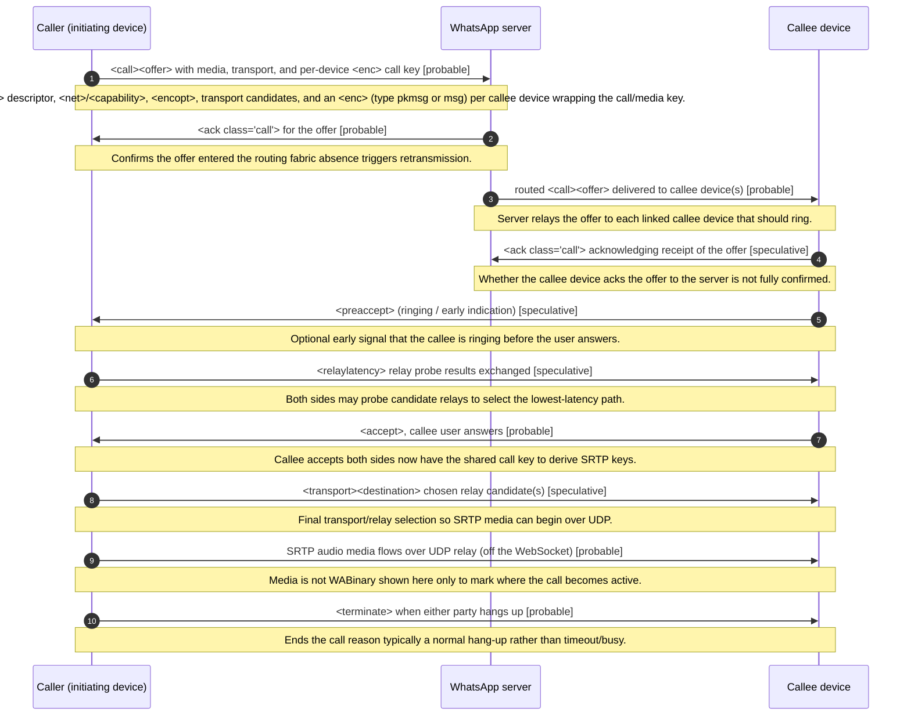

<!-- GENERATED FILE. Do not edit by hand. Source: spec/ corpus. Run `npm run generate` to regenerate. -->

# Outgoing 1:1 audio call

**Status:** draft  
**Spec version:** 0.1.0

## Summary

The happy-path sequence for placing a 1:1 audio call from the local (caller) device to a remote contact that answers. The caller sends a server-routed <call><offer> carrying media descriptors, transport candidates, and one or more <enc> nodes wrapping the call/media key for each callee device. The server acks the offer and routes it to the callee's device(s), which may ring (<preaccept>) and then <accept>. Once accepted, both sides derive SRTP keys from the Signal-delivered call key and media flows over UDP relays, with relay-latency and transport updates tuning the path. Step ordering and which hops are acked are a working model; confidence is hedged per step.

## Sequence

## Participants

- **Caller (initiating device)** (`caller`)
- **WhatsApp server** (`server`)
- **Callee device** (`callee`)

## Steps

| # | From | To | Message | Stanza | Confidence | Note |
| --- | --- | --- | --- | --- | --- | --- |
| 1 | caller | server | <call><offer> with media, transport, and per-device <enc> call key | [`call-offer`](../stanzas/call-offer.md) | probable | Offer includes <audio> descriptor, <net>/<capability>, <encopt>, transport candidates, and an <enc> (type pkmsg or msg) per callee device wrapping the call/media key. |
| 2 | server | caller | <ack class="call"> for the offer | [`call-ack`](../stanzas/call-ack.md) | probable | Confirms the offer entered the routing fabric; absence triggers retransmission. |
| 3 | server | callee | routed <call><offer> delivered to callee device(s) | [`call-offer`](../stanzas/call-offer.md) | probable | Server relays the offer to each linked callee device that should ring. |
| 4 | callee | server | <ack class="call"> acknowledging receipt of the offer | [`call-ack`](../stanzas/call-ack.md) | speculative | Whether the callee device acks the offer to the server is not fully confirmed. |
| 5 | callee | caller | <preaccept> (ringing / early indication) | [`call-preaccept`](../stanzas/call-preaccept.md) | speculative | Optional early signal that the callee is ringing before the user answers. |
| 6 | caller | callee | <relaylatency> relay probe results exchanged | [`call-relaylatency`](../stanzas/call-relaylatency.md) | speculative | Both sides may probe candidate relays to select the lowest-latency path. |
| 7 | callee | caller | <accept>, callee user answers | [`call-accept`](../stanzas/call-accept.md) | probable | Callee accepts; both sides now have the shared call key to derive SRTP keys. |
| 8 | caller | callee | <transport><destination> chosen relay candidate(s) | [`call-transport`](../stanzas/call-transport.md) | speculative | Final transport/relay selection so SRTP media can begin over UDP. |
| 9 | caller | callee | SRTP audio media flows over UDP relay (off the WebSocket) | - | probable | Media is not WABinary; shown here only to mark where the call becomes active. |
| 10 | caller | callee | <terminate> when either party hangs up | [`call-terminate`](../stanzas/call-terminate.md) | probable | Ends the call; reason typically a normal hang-up rather than timeout/busy. |

## Open questions

- Is <preaccept> always emitted, or only under certain network/UI conditions?
- Which hops require an <ack> versus being best-effort?
- Does relay selection complete before or after <accept>?
- Are transport candidates re-sent after accept, or only carried in the original offer?

---

[Back to flow catalog](./index.md) · [Spec overview](../index.md)
